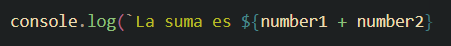
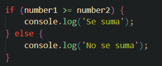

## Operadores 
- Vimos la declaracion de variables y como hacer operaciones como suma, resta, multiplicacion y division con esas variables.

## Concatenacion template string
- Poder juntar texto con el resultado de una operacion y mostrarlo en la consola.

## Estructuras de control
- Permite mostrar un resultado dependiendo de si se cumple una condicion.

